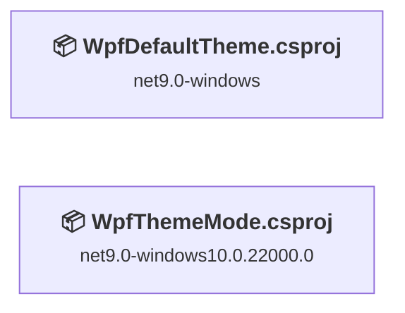
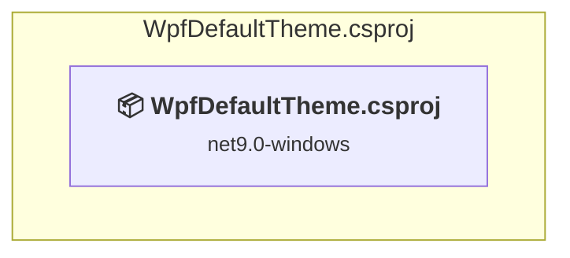
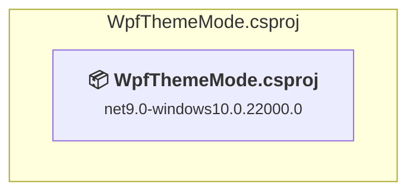

# Projects and dependencies analysis

This document provides a comprehensive overview of the projects and their dependencies in the context of upgrading to .NETCoreApp,Version=v10.0.

## Table of Contents

- [Executive Summary](#executive-Summary)
  - [Highlevel Metrics](#highlevel-metrics)
  - [Projects Compatibility](#projects-compatibility)
  - [Package Compatibility](#package-compatibility)
  - [API Compatibility](#api-compatibility)
  - [Binding Redirect Configuration](#binding-redirect-configuration)
- [Aggregate NuGet packages details](#aggregate-nuget-packages-details)
- [Top API Migration Challenges](#top-api-migration-challenges)
  - [Technologies and Features](#technologies-and-features)
  - [Most Frequent API Issues](#most-frequent-api-issues)
- [Projects Relationship Graph](#projects-relationship-graph)
- [Project Details](#project-details)

  - [WpfDefaultTheme\WpfDefaultTheme.csproj](#wpfdefaultthemewpfdefaultthemecsproj)
  - [WpfThemeMode\WpfThemeMode.csproj](#wpfthememodewpfthememodecsproj)

## Executive Summary

### Highlevel Metrics

| Metric | Count | Status |
| :--- | :---: | :--- |
| Total Projects | 2 | All require upgrade |
| Total NuGet Packages | 2 | 1 need upgrade |
| Total Code Files | 13 |  |
| Total Code Files with Incidents | 18 |  |
| Total Lines of Code | 337 |  |
| Total Number of Issues | 78 |  |
| Estimated LOC to modify | 75+ | at least 22.3% of codebase |

### Projects Compatibility

| Project | Target Framework | Difficulty | Package Issues | API Issues | Binding Issues | Est. LOC Impact | Description |
| :--- | :---: | :---: | :---: | :---: | :---: | :---: | :--- |
| [WpfDefaultTheme\WpfDefaultTheme.csproj](#wpfdefaultthemewpfdefaultthemecsproj) | net9.0-windows | 🟢 Low | 1 | 37 | 0 | 37+ | Wpf, Sdk Style = True |
| [WpfThemeMode\WpfThemeMode.csproj](#wpfthememodewpfthememodecsproj) | net9.0-windows10.0.22000.0 | 🟢 Low | 0 | 38 | 0 | 38+ | Wpf, Sdk Style = True |

### Package Compatibility

| Status | Count | Percentage |
| :--- | :---: | :---: |
| ✅ Compatible | 1 | 50.0% |
| ⚠️ Incompatible | 1 | 50.0% |
| 🔄 Upgrade Recommended | 0 | 0.0% |
| ***Total NuGet Packages*** | ***2*** | ***100%*** |

### API Compatibility

| Category | Count | Impact |
| :--- | :---: | :--- |
| 🔴 Binary Incompatible | 57 | High - Require code changes |
| 🟡 Source Incompatible | 0 | Medium - Needs re-compilation and potential conflicting API error fixing |
| 🔵 Behavioral change | 18 | Low - Behavioral changes that may require testing at runtime |
| ✅ Compatible | 753 |  |
| ***Total APIs Analyzed*** | ***828*** |  |

## Aggregate NuGet packages details

| Package | Current Version | Suggested Version | Projects | Description |
| :--- | :---: | :---: | :--- | :--- |
| CommunityToolkit.Mvvm | 8.4.0 |  | [WpfDefaultTheme.csproj](#wpfdefaultthemewpfdefaultthemecsproj) [WpfThemeMode.csproj](#wpfthememodewpfthememodecsproj) | ✅Compatible |
| Microsoft.Xaml.Behaviors.Wpf | 1.1.135 | 1.1.39 | [WpfDefaultTheme.csproj](#wpfdefaultthemewpfdefaultthemecsproj) | ⚠️NuGet パッケージに互換性がありません |

## Top API Migration Challenges

### Technologies and Features

| Technology | Issues | Percentage | Migration Path |
| :--- | :---: | :---: | :--- |
| WPF (Windows Presentation Foundation) | 9 | 12.0% | WPF APIs for building Windows desktop applications with XAML-based UI that are available in .NET on Windows. WPF provides rich desktop UI capabilities with data binding and styling. Enable Windows Desktop support: Option 1 (Recommended): Target net9.0-windows; Option 2: Add <UseWindowsDesktop>true</UseWindowsDesktop>. |

### Most Frequent API Issues

| API | Count | Percentage | Category |
| :--- | :---: | :---: | :--- |
| T:System.Windows.Application | 10 | 13.3% | Binary Incompatible |
| T:System.Uri | 10 | 13.3% | Behavioral Change |
| M:System.Uri.#ctor(System.String,System.UriKind) | 8 | 10.7% | Behavioral Change |
| M:System.Windows.Window.#ctor | 8 | 10.7% | Binary Incompatible |
| T:System.Windows.Window | 6 | 8.0% | Binary Incompatible |
| M:System.Windows.Application.LoadComponent(System.Object,System.Uri) | 6 | 8.0% | Binary Incompatible |
| T:System.Windows.Markup.IComponentConnector | 4 | 5.3% | Binary Incompatible |
| T:System.Windows.DependencyProperty | 3 | 4.0% | Binary Incompatible |
| F:System.Windows.DependencyProperty.UnsetValue | 3 | 4.0% | Binary Incompatible |
| M:System.Windows.Markup.InternalTypeHelper.#ctor | 2 | 2.7% | Binary Incompatible |
| T:System.Windows.Markup.InternalTypeHelper | 2 | 2.7% | Binary Incompatible |
| M:System.Windows.Application.Run | 2 | 2.7% | Binary Incompatible |
| P:System.Windows.Application.StartupUri | 2 | 2.7% | Binary Incompatible |
| M:System.Windows.Application.#ctor | 2 | 2.7% | Binary Incompatible |
| P:System.Windows.FrameworkElement.DataContext | 2 | 2.7% | Binary Incompatible |
| M:System.Windows.Window.Show | 1 | 1.3% | Binary Incompatible |
| P:System.Windows.Application.Current | 1 | 1.3% | Binary Incompatible |
| P:System.Windows.Application.MainWindow | 1 | 1.3% | Binary Incompatible |
| P:System.Windows.Window.Owner | 1 | 1.3% | Binary Incompatible |
| T:System.Windows.Data.IValueConverter | 1 | 1.3% | Binary Incompatible |

## Projects Relationship Graph

Legend:
📦 SDK-style project
⚙️ Classic project

## Project Details

### WpfDefaultTheme\WpfDefaultTheme.csproj

#### Project Info

- **Current Target Framework:** net9.0-windows
- **Proposed Target Framework:** net10.0-windows
- **SDK-style**: True
- **Project Kind:** Wpf
- **Dependencies**: 0
- **Dependants**: 0
- **Number of Files**: 6
- **Number of Files with Incidents**: 9
- **Lines of Code**: 160
- **Estimated LOC to modify**: 37+ (at least 23.1% of the project)

#### Dependency Graph

Legend:
📦 SDK-style project
⚙️ Classic project

### API Compatibility

| Category | Count | Impact |
| :--- | :---: | :--- |
| 🔴 Binary Incompatible | 28 | High - Require code changes |
| 🟡 Source Incompatible | 0 | Medium - Needs re-compilation and potential conflicting API error fixing |
| 🔵 Behavioral change | 9 | Low - Behavioral changes that may require testing at runtime |
| ✅ Compatible | 391 |  |
| ***Total APIs Analyzed*** | ***428*** |  |

#### Project Technologies and Features

| Technology | Issues | Percentage | Migration Path |
| :--- | :---: | :---: | :--- |
| WPF (Windows Presentation Foundation) | 4 | 10.8% | WPF APIs for building Windows desktop applications with XAML-based UI that are available in .NET on Windows. WPF provides rich desktop UI capabilities with data binding and styling. Enable Windows Desktop support: Option 1 (Recommended): Target net9.0-windows; Option 2: Add <UseWindowsDesktop>true</UseWindowsDesktop>. |

### WpfThemeMode\WpfThemeMode.csproj

#### Project Info

- **Current Target Framework:** net9.0-windows10.0.22000.0
- **Proposed Target Framework:** net10.0-windows
- **SDK-style**: True
- **Project Kind:** Wpf
- **Dependencies**: 0
- **Dependants**: 0
- **Number of Files**: 7
- **Number of Files with Incidents**: 9
- **Lines of Code**: 177
- **Estimated LOC to modify**: 38+ (at least 21.5% of the project)

#### Dependency Graph

Legend:
📦 SDK-style project
⚙️ Classic project

### API Compatibility

| Category | Count | Impact |
| :--- | :---: | :--- |
| 🔴 Binary Incompatible | 29 | High - Require code changes |
| 🟡 Source Incompatible | 0 | Medium - Needs re-compilation and potential conflicting API error fixing |
| 🔵 Behavioral change | 9 | Low - Behavioral changes that may require testing at runtime |
| ✅ Compatible | 362 |  |
| ***Total APIs Analyzed*** | ***400*** |  |

#### Project Technologies and Features

| Technology | Issues | Percentage | Migration Path |
| :--- | :---: | :---: | :--- |
| WPF (Windows Presentation Foundation) | 5 | 13.2% | WPF APIs for building Windows desktop applications with XAML-based UI that are available in .NET on Windows. WPF provides rich desktop UI capabilities with data binding and styling. Enable Windows Desktop support: Option 1 (Recommended): Target net9.0-windows; Option 2: Add <UseWindowsDesktop>true</UseWindowsDesktop>. |

